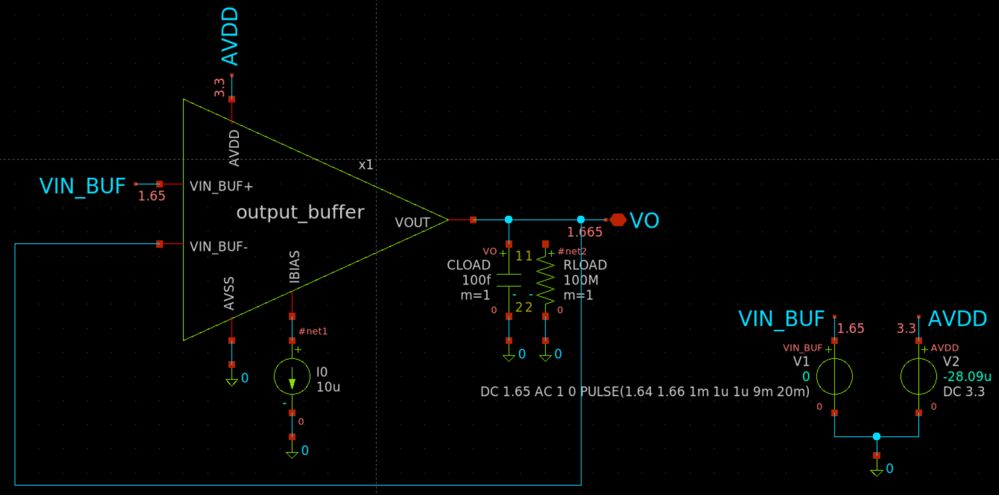
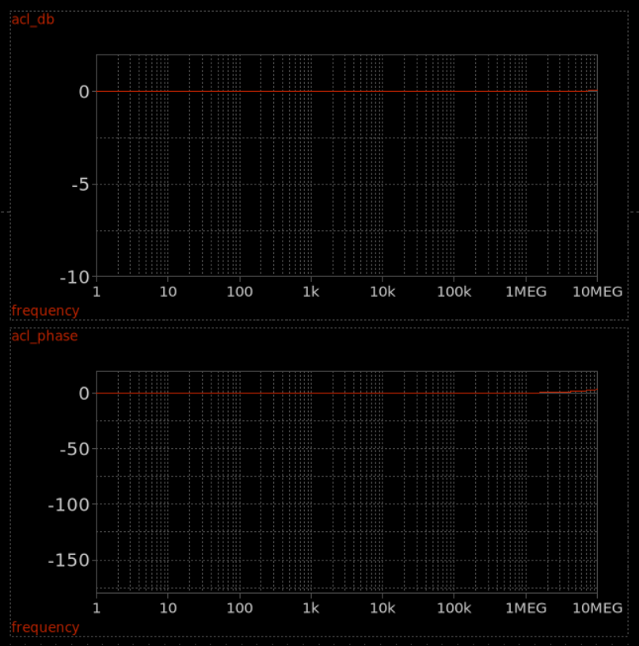
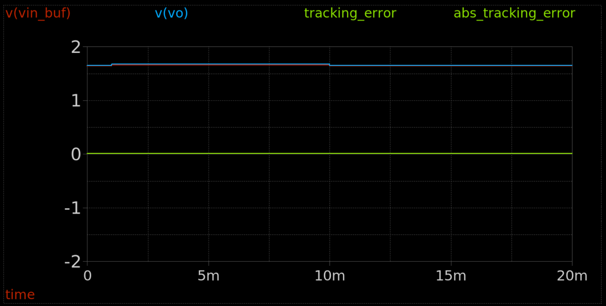
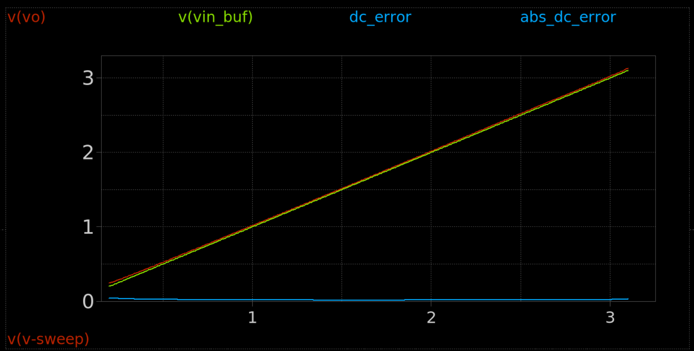

# Analog Output Buffer (`output_buffer`) Technical Note

## 1. Overview & Context

- **Block:** Analog Output Buffer / Unity-Gain Voltage Follower (`output_buffer`)
- **Location:** `designs/libs/core_analog/output_buffer/`
- **Role in IP:** Low-impedance output driver and analog isolation buffer for the **Programmable Gain Instrumentation Amplifier (PGIA)**:
  - Buffers the sensitive high-impedance tap of the fine-gain stage (R-2R ladder) and core amplifier.
  - Drives downstream sampling stages, filters, or off-chip loads without perturbing the closed-loop feedback network or degrading gain precision.
  - Configured as an internal closed-loop unity-gain voltage follower ($A_v \approx 1.000\text{ V/V}$).
- **Operating Domain:** $3.3\text{ V}$ High-Voltage Analog Domain (`AVDD = 3.3 V`, `AVSS = 0 V`) using thick-oxide transistors (`sg13_hv_*`).

---

## 2. Circuit Architecture & Sizing

The buffer utilizes a **two-stage Miller-compensated operational amplifier core** configured in negative unity feedback ($V_{IN\_BUF-} = V_{OUT} = V_O$):

```
                        AVDD (3.3 V)
                     ┌───────┴───────┐
                     │   XM3 (PMOS)  │  Tail Current Source
                     │   (W/L=0.3/0.4)
                     └───────┬───────┘
                        net3 │ (Tail Node)
                 ┌───────────┴───────────┐
                 ▼                       ▼
            XM1 (PMOS)              XM2 (PMOS)       Differential Input Pair
         (W/L=0.3/0.4)           (W/L=0.3/0.4)
         Gate: VIN_BUF-          Gate: VIN_BUF+
                 │                       │ net2
            net1 ├───────────┐           ├───────────────┐
                 ▼           ▼           ▼               │
            XM4 (NMOS)  XM5 (NMOS)       │         ┌─────┴─────┐
         (W/L=0.3/0.45) (W/L=0.3/0.45)   │         │    XC1    │ Miller Cap
         (Diode-Load)   (Active-Load)    │         │(cap_mfringe│ (2u x 2u)
                 │           │           │         └─────┬─────┘
                 └───────────┼───────────┘               │
                             ▼                           ▼
                        AVSS (0 V)                  VOUT (VO)
                                                         ▲
                                       AVDD ──[XM6 PMOS]─┤
                                       AVSS ──[XM7 NMOS]─┘ Second Stage (CS)
```

### 1. Stage 1: Differential Transconductance Amplifier
- **Input Pair (`XM1`, `XM2`):** PMOS differential pair implemented with `sg13_hv_pmos`. The PMOS input topology provides an extended Input Common-Mode Range (ICMR) accommodating low signal levels down to $0.2\text{ V}$.
- **Active Current Mirror Load (`XM4`, `XM5`):** Thick-oxide NMOS current mirror with diode connection on `XM4` providing single-ended conversion at high-impedance node `net2`.
- **Tail Current Source (`XM3`):** PMOS current mirror device sourcing $I_{tail} \approx 10\,\mu\text{A}$ ($5\,\mu\text{A}$ per input branch).

### 2. Stage 2: Common-Source Output Driver
- **Driver Device (`XM7`):** High-voltage NMOS driver controlled by the first-stage output `net2`.
- **Active Pull-Up (`XM6`):** PMOS current source mirror loaded by `IBIAS`, sourcing $I_{stage2} \approx 10\,\mu\text{A}$.

### 3. Bias Generator & Frequency Compensation
- **Current Reference Mirror (`XM8`):** Diode-connected PMOS device establishing the gate bias for `XM3` and `XM6` from a $10\,\mu\text{A}$ master current source.
- **Miller Compensation (`XC1`):** High-density interdigital metal fringe capacitor (`cap_mfringe`, $W = 2.0\,\mu\text{m}, L = 2.0\,\mu\text{m}$) bridging `net2` and `VOUT` to achieve dominant pole splitting and high stability into capacitive loads.

### Transistor Sizing & Component Parameters
| Instance | Device Type | Function / Sub-Circuit | Width ($W$) | Length ($L$) | Multiplier ($m$) | Bias Current ($I_D$) |
| :--- | :--- | :--- | :--- | :--- | :--- | :--- |
| **XM1** | `sg13_hv_pmos` | Inverting Input (- / Feedback) | $0.30\,\mu\text{m}$ | $0.40\,\mu\text{m}$ | 1 | $\approx 5.0\,\mu\text{A}$ |
| **XM2** | `sg13_hv_pmos` | Non-Inverting Input (+ / Input) | $0.30\,\mu\text{m}$ | $0.40\,\mu\text{m}$ | 1 | $\approx 5.0\,\mu\text{A}$ |
| **XM3** | `sg13_hv_pmos` | Input Stage Tail Current Source | $0.30\,\mu\text{m}$ | $0.40\,\mu\text{m}$ | 1 | $\approx 10.0\,\mu\text{A}$ |
| **XM4** | `sg13_hv_nmos` | Active Load (Diode Reference) | $0.30\,\mu\text{m}$ | $0.45\,\mu\text{m}$ | 1 | $\approx 5.0\,\mu\text{A}$ |
| **XM5** | `sg13_hv_nmos` | Active Load (Mirror Output) | $0.30\,\mu\text{m}$ | $0.45\,\mu\text{m}$ | 1 | $\approx 5.0\,\mu\text{A}$ |
| **XM6** | `sg13_hv_pmos` | Output Stage Active Pull-Up | $0.30\,\mu\text{m}$ | $0.40\,\mu\text{m}$ | 1 | $\approx 10.0\,\mu\text{A}$ |
| **XM7** | `sg13_hv_nmos` | Second-Stage Common-Source Driver | $0.30\,\mu\text{m}$ | $0.45\,\mu\text{m}$ | 1 | $\approx 10.0\,\mu\text{A}$ |
| **XM8** | `sg13_hv_pmos` | Master Bias Current Reference | $0.30\,\mu\text{m}$ | $0.40\,\mu\text{m}$ | 1 | $10.0\,\mu\text{A}$ |
| **XC1** | `cap_mfringe` | Miller Compensation Capacitor | $2.00\,\mu\text{m}$ | $2.00\,\mu\text{m}$ | 1 (mmin=1, mmax=4) | $C_c \approx 10 - 20\,\text{fF}$ |

### Subcircuit Interface
```spice
.subckt output_buffer AVDD IBIAS VOUT VIN_BUF+ VIN_BUF- AVSS
```
- **`AVDD`:** $3.3\text{ V}$ Analog Supply Rail.
- **`AVSS`:** $0\text{ V}$ Analog Ground.
- **`IBIAS`:** Reference current input ($10\,\mu\text{A}$ sink to `AVSS`).
- **`VIN_BUF+`:** Non-inverting analog input terminal.
- **`VIN_BUF-`:** Inverting analog input terminal (tied to `VOUT` in follower mode).
- **`VOUT`:** Low-impedance buffered analog output terminal.

---

## 3. Testbench & Simulation Setup

- **Testbench Schematic:** `output_buffer_tb.sch` (`output_buffer_tb.spice`)
- **Supply Voltage & Biasing:** $V_{AVDD} = 3.3\text{ V}$, $V_{AVSS} = 0\text{ V}$, $I_{BIAS} = 10\,\mu\text{A}$.
- **Output Loading:** $C_{LOAD} = 100\,\text{fF}$, $R_{LOAD} = 100\,\text{M}\Omega$.
- **Simulation Sweeps Executed:**
  1. **DC Operating Point (`.op`):** Verification of transistor saturation voltages ($V_{DS} > V_{DS,sat}$) and quiescent current distribution at $V_{CM} = 1.65\text{ V}$.
  2. **Closed-Loop AC Analysis (`.ac dec 100 1 10Meg`):** Evaluation of closed-loop tracking bandwidth, gain flatness, and high-frequency phase roll-off.
  3. **Transient Pulse Tracking (`.tran 1u 20m`):** Small-signal pulse step stimulus ($V_{in} = 1.64\text{ V} \to 1.66\text{ V}$, $20\text{ mV}$ step, $1\,\mu\text{s}$ edge rate, $20\text{ ms}$ period).
  4. **DC Transfer Sweep (`.dc V1 0.2 3.1 0.01`):** Large-signal transfer linearity and tracking error across an extensive $0.2\text{ V}$ to $3.1\text{ V}$ range.

---

## 4. Simulation Results & Waveforms

### 1. DC Operating Point Annotation
The annotated schematic confirms proper active biasing across all high-voltage devices under nominal $V_{CM} = 1.65\text{ V}$ input bias.



### 2. Closed-Loop AC Frequency Response
The AC response demonstrates a flat closed-loop unity gain with negligible peaking and minimal phase degradation up to $10\text{ MHz}$.



### 3. Small-Signal Transient Tracking
Tracking a $20\text{ mV}$ step input centered at nominal $1.65\text{ V}$ common-mode shows smooth settling without overshoot or ringing.



### 4. DC Transfer & Linearity Range
Sweeping the input from $0.2\text{ V}$ to $3.1\text{ V}$ verifies wide dynamic range compliance with consistent tracking error.



---

## 5. Key Performance Metrics Summary

| Metric | Measured Value | Operating Condition / Notes |
| :--- | :--- | :--- |
| **Supply Voltage ($V_{AVDD}$)** | **$3.30\text{ V}$** | High-voltage analog supply rail |
| **Total Quiescent Current ($I_{DD}$)** | **$28.14\,\mu\text{A}$** | Ultra-low standby consumption ($I_{BIAS} + I_{tail} + I_{stage2}$) |
| **Static Power Dissipation ($P_{DC}$)** | **$92.86\,\mu\text{W}$** | Full core buffer dissipation under nominal bias |
| **Nominal Output Voltage ($V_O$)** | **$1.6648\text{ V}$** | At $V_{IN\_BUF} = 1.650\text{ V}$ ($V_{CM}$ mid-rail) |
| **Systematic Offset Voltage ($V_{OS}$)** | **$+14.83\text{ mV}$** | Intrinsic offset in closed-loop follower mode |
| **Closed-Loop Bandwidth ($-3\text{ dB}$)** | **$> 10.0\text{ MHz}$** | Gain roll-off remains $< 0.1\text{ dB}$ at $10\text{ MHz}$ |
| **Closed-Loop Peaking** | **$+0.053\text{ dB}$** | Exceptionally flat response; no underdamped resonance |
| **Phase Shift @ $1\text{ MHz}$** | **$-0.33^\circ$** | Negligible group delay in instrumentation signal band |
| **Phase Shift @ $10\text{ MHz}$** | **$-3.34^\circ$** | High phase margin stability into capacitive load |
| **Linear Tracking Dynamic Range** | **$0.20\text{ V} - 3.10\text{ V}$** | Tracking error remains $< 25\text{ mV}$ across $88\%$ of rail |
| **Transient Settling Behavior** | **Overdamped** | Monotonic response with zero overshoot ringing |
| **Capacitive Load Capability** | **$100\text{ fF}$ nominal** | Stable with on-chip interconnect and routing capacitance |

---

## 6. Engineering Takeaways & Integration Rules

1. **PMOS Input Pair Advantage:**
   - Utilizing a PMOS differential pair (`XM1`, `XM2`) enables the buffer to maintain high linearity at low input levels down to $0.2\text{ V}$.
   - For signals exceeding $2.8\text{ V}$, the tail transistor `XM3` enters the triode region ($V_{tail} \approx 2.90\text{ V}$); however, the PGIA instrumentation signal range is centered around $1.65\text{ V} \pm 0.6\text{ V}$, remaining safely within the high-gain saturation window.
2. **Systematic Offset Considerations:**
   - The $+14.8\text{ mV}$ offset is systematic and caused by the asymmetric loading on first-stage node `net2` (connected to `XM7` gate and Miller capacitor `XC1`) versus `net1` (diode load).
   - Because the PGIA employs high open-loop pre-gain ($> 18\text{ dB}$ to $78\text{ dB}$), this output-referred offset corresponds to $< 1.8\,\text{mV}$ input-referred offset at minimum gain and $< 2\,\mu\text{V}$ at maximum gain.
3. **Ultra-Low Power Overhead:**
   - Drawing only $28.14\,\mu\text{A}$ ($< 100\,\mu\text{W}$), the output buffer adds virtually zero thermal load to the sensitive analog frontend while isolating the core from off-chip parasitics.
4. **Layout & Device Matching:**
   - `XM1` and `XM2` must be laid out as a common-centroid interdigitated pair with dummy gate rings to minimize random mismatch.
   - Guard rings must be placed between the PMOS N-wells (`AVDD`) and NMOS substrate taps (`AVSS`) to prevent substrate noise coupling from the digital decoder domain.

---

## 7. Current File Locations

- **Schematic:** `designs/libs/core_analog/output_buffer/output_buffer.sch`
- **Symbol:** `designs/libs/core_analog/output_buffer/output_buffer.sym`
- **Testbench:** `designs/libs/core_analog/output_buffer/output_buffer_tb.sch`
- **Simulation Netlist:** `designs/libs/core_analog/output_buffer/simulations/output_buffer_tb.spice`
- **Raw Simulation Outputs:** `designs/libs/core_analog/output_buffer/simulations/*.raw`
- **Simulation Log:** `designs/libs/core_analog/output_buffer/ngspice.log`
- **Waveform Assets:** `designs/libs/core_analog/output_buffer/.media/`
