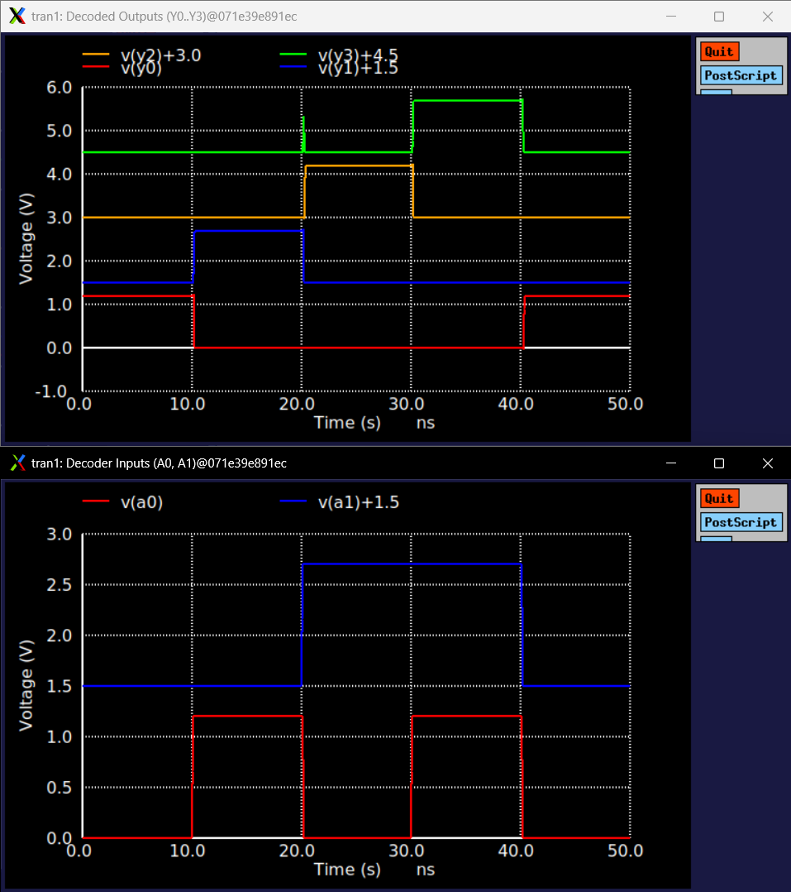

# 2-to-4 Binary Decoder (`dec2to4`) Technical Note

## 1. Overview & Context

- **Block:** 2-to-4 Active-High Binary Decoder (`dec2to4`)
- **Location:** `designs/libs/core_digital/dec2to4/`
- **Role in IP:** Serves as the core pre-decoding building block for the programmable gain network:
  - **Coarse-Gain Network (`dec4to16`):** Two `dec2to4` instances act as pre-decoders for `D[1:0]` and `D[3:2]`, driving the 16-switch coarse ladder array.
  - **Operating Domain:** $1.2\text{ V}$ Core/Digital domain (`DVDD` / `DVSS`).

---

## 2. Circuit Architecture & Logic Mapping

The block is implemented with IHP SG13CMOS5L standard cells (`sg13cmos5l_stdcells`), ensuring compact layout, balanced drive, and DRC/LVS cleanliness.

### Logic Implementation
* **Address Inverters ($2\times$ `sg13cmos5l_inv_1`):** Generate internal inverted address rails $\overline{A_0}$ and $\overline{A_1}$.
* **Minterm AND Gates ($4\times$ `sg13cmos5l_and2_1`):** Decode the 4 unique binary combinations into mutually exclusive active-high outputs $Y_0 - Y_3$.

$$\begin{aligned}
Y_0 &= \overline{A_1} \cdot \overline{A_0} \quad (\text{State } 00) \\
Y_1 &= \overline{A_1} \cdot A_0 \quad (\text{State } 01) \\
Y_2 &= A_1 \cdot \overline{A_0} \quad (\text{State } 10) \\
Y_3 &= A_1 \cdot A_0 \quad (\text{State } 11)
\end{aligned}$$

### Subcircuit Interface
```spice
.subckt dec2to4 A0 A1 Y0 Y1 Y2 Y3 VDD VSS
```
* **Inputs:** `A0` (LSB), `A1` (MSB).
* **Outputs:** `Y0`, `Y1`, `Y2`, `Y3` (One-hot active-high decoded outputs).
* **Power Supplies:** `VDD` ($1.2\text{ V}$), `VSS` ($0\text{ V}$).

---

## 3. Truth Table

| State | A1 (MSB) | A0 (LSB) | Y0 | Y1 | Y2 | Y3 | Decoded Active Branch |
| :---: | :---: | :---: | :---: | :---: | :---: | :---: | :---: |
| 00 | 0 (0 V) | 0 (0 V) | **1 (1.2 V)** | 0 (0 V) | 0 (0 V) | 0 (0 V) | Branch 0 |
| 01 | 0 (0 V) | 1 (1.2 V) | 0 (0 V) | **1 (1.2 V)** | 0 (0 V) | 0 (0 V) | Branch 1 |
| 10 | 1 (1.2 V) | 0 (0 V) | 0 (0 V) | 0 (0 V) | **1 (1.2 V)** | 0 (0 V) | Branch 2 |
| 11 | 1 (1.2 V) | 1 (1.2 V) | 0 (0 V) | 0 (0 V) | 0 (0 V) | **1 (1.2 V)** | Branch 3 |

---

## 4. Testbench & Simulation Setup

* **Testbench Schematic:** `tb_dec2to4.sch` (`tb_dec2to4.spice`)
* **Supply Voltages:** `VDD = 1.2 V`, `VSS = 0 V`
* **Input Stimulus:** Synchronized pulse generators stepping through all 4 binary states sequentially:
  * `VA0` (LSB): `PULSE(0 1.2 10n 100p 100p 10n 20n)` ($T = 20\text{ ns}$, Delay = $10\text{ ns}$)
  * `VA1` (MSB): `PULSE(0 1.2 20n 100p 100p 20n 40n)` ($T = 40\text{ ns}$, Delay = $20\text{ ns}$)
* **Output Loading:** $C_{L0} - C_{L3} = 10\text{ fF}$ (modeling downstream transmission gate and routing capacitance).
* **Analysis Control:**
  ```spice
  .control
    tran 10p 50n
    write tb_dec2to4.raw
    plot v(A0) v(A1)+1.5 title 'Decoder Inputs (A0, A1)'
    plot v(Y0) v(Y1)+1.5 v(Y2)+3.0 v(Y3)+4.5 title 'Decoded Outputs (Y0..Y3)'
  .endc
  ```

---

## 5. Simulation Results & Waveforms



### Key Metrics Summary
| Parameter | Value | Condition / Notes |
| :--- | :--- | :--- |
| **Logic Output High ($V_{OH}$)** | $1.200\text{ V}$ | Full rail-to-rail swing |
| **Logic Output Low ($V_{OL}$)** | $< 1\text{ nV}$ | Zero static leakage offset |
| **Propagation Delay ($t_{pd}$)** | $< 180\text{ ps}$ | $50\% \to 50\%$ transition into $10\text{ fF}$ load |
| **One-Hot Select Integrity** | $100\%$ Verified | Exactly one output is high per active cycle |
| **Spurious Glitch Peak** | $< 0.15\text{ V}$ | Dynamic transitions well below switching threshold ($V_{TH} \approx 0.6\text{ V}$) |

---

## 6. Important EDA & Integration Takeaways

1. **Xschem Subcircuit Header Requirement:**
   * Custom subcircuit symbols must define `type=subcircuit`, `format="@name @pinlist @symname"`, and `template="name=x1"` in the symbol `K` attribute block to prevent netlister dropouts.
2. **PDK Standard Cell Netlisting in Xschem:**
   * When using `sg13cmos5l_stdcells` as leaf subcircuits in SPICE, symbols must use `format="@name @pinlist @VDD @VSS @symname"` and be linked via `.include .../sg13cmos5l_stdcell.spice`.
3. **Modularity for `dec4to16`:**
   * Two `dec2to4` instances can now be directly instantiated in `dec4to16.sch` to generate 8 pre-decoded lines ($P_0 - P_3, Q_0 - Q_3$), which feed 16 NOR/NAND driver gates.

---

## 7. Current File Locations

* **Schematic:** `designs/libs/core_digital/dec2to4/dec2to4.sch`
* **Symbol:** `designs/libs/core_digital/dec2to4/dec2to4.sym`
* **Testbench:** `designs/libs/core_digital/dec2to4/tb_dec2to4.sch`
* **Simulation Netlist & Raw:** `designs/libs/core_digital/dec2to4/simulations/tb_dec2to4.spice` / `tb_dec2to4.raw`
* **Simulation Log:** `docs/digital_decoder/dec2to4/ngspice_log.txt`
