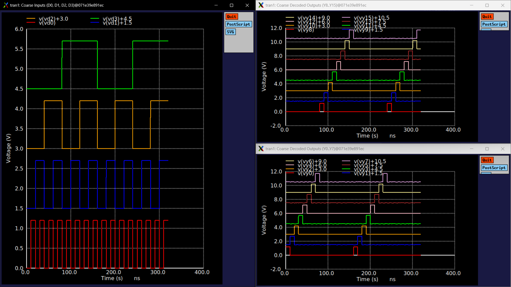
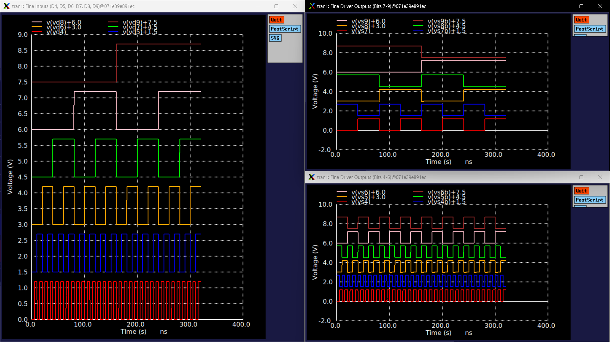

# 10-Bit Top-Level Digital Decoder (`decoder_top_10b`) Technical Note

## 1. Overview & Context

- **Block:** 10-Bit Top-Level Digital Decoder Subsystem (`decoder_top_10b`)
- **Location:** `designs/libs/core_digital/decoder_top_10b/`
- **Role in IP:** Central digital control hub for the **Programmable Gain Instrumentation Amplifier (PGIA)**:
  - Takes the master 10-bit digital gain control word (`D0 - D9`, 1024 programmable gain levels).
  - Drives all 28 physical analog switch control lines across both the Coarse-Gain Stage (Stage 2) and Fine-Gain Stage (Stage 3).
  - Delivers total linear-in-dB gain tuning from **$18.06\text{ dB}$ to $78.00\text{ dB}$** with ultra-fine **$+0.0586\text{ dB}$/LSB resolution**.
- **Operating Domain:** $1.2\text{ V}$ Core/Digital domain (`DVDD` / `DVSS`).

---

## 2. Circuit Architecture & Sub-Block Integration

The top-level decoder is a clean hierarchical integration combining two specialized digital sub-blocks:

```
                         ┌────────────────────────────────────────────────────────┐
                         │                    decoder_top_10b                     │
                         │                                                        │
                         │   ┌──────────────┐                                     │
  D[3:0] (Coarse 4-bit) ─┼──►│   dec4to16   ├──► Y0 - Y15 (16 Coarse Tap Lines)   │
                         │   │(x_coarse_dec)│                                     │
                         │   └──────────────┘                                     │
                         │                                                        │
                         │   ┌──────────────┐                                     │
  D[9:4] (Fine 6-bit)   ─┼──►│fine_driver_6b├──► S4..S9, S4B..S9B (12 Fine Lines) │
                         │   │(x_fine_driver│                                     │
                         │   └──────────────┘                                     │
                         └────────────────────────────────────────────────────────┘
```

### Sub-Block Breakdown
1. **Coarse Decoder (`x_coarse_dec` $\to$ `dec4to16`):**
   * Inputs: `D0, D1, D2, D3` (Bits 0–3).
   * Outputs: 16 one-hot active-high lines ($Y_0 - Y_{15}$) controlling the 16 feedback tap switches along the 17-resistor coarse string ($0\text{ dB}$ to $+56.25\text{ dB}$ in $+3.75\text{ dB}$ steps).
2. **Fine Driver Array (`x_fine_driver` $\to$ `fine_driver_6b`):**
   * Inputs: `D4, D5, D6, D7, D8, D9` (Bits 4–9).
   * Outputs: 6 pairs of matched true/complementary lines ($S_4/S_{4B}$ through $S_9/S_{9B}$) controlling the 6-bit R-2R ladder steering switches ($0\text{ dB}$ to $+3.69\text{ dB}$ in $+0.0586\text{ dB}$ steps).

### Subcircuit Interface
```spice
.subckt decoder_top_10b D0 D3 Y0 Y1 Y2 Y3 VDD VSS Y4 Y5 Y6 Y7 Y8 Y9 Y10 Y11 Y12 Y13 Y14 Y15 D1 D2 D4 D7 D5 D6 D8 D9 S4 S4B S5 S5B S6 S6B S7 S7B S8 S8B S9 S9B
```
* **Inputs (10):** `D0` through `D9` (Digital gain word).
* **Outputs (28):**
  * `Y0` through `Y15` (16 Coarse Select Lines).
  * `S4, S4B, S5, S5B, S6, S6B, S7, S7B, S8, S8B, S9, S9B` (12 Fine Steering Lines).
* **Power Supplies (2):** `VDD` ($1.2\text{ V}$), `VSS` ($0\text{ V}$).

---

## 3. Digital-to-Analog Gain Mapping Table

| Gain Domain | Control Bits | Target Block | Active Circuit Topology | Gain Range | Step Size |
| :--- | :---: | :---: | :--- | :---: | :---: |
| **Input Stage (Stage 1)** | — | Buffer / Diff-Amp | Instrumentation Fixed Preamplifier | **18.06 dB** | Fixed (8.00 V/V) |
| **Coarse Tuning (Stage 2)** | `D[3:0]` (4 bits) | `dec4to16` | 17-Resistor Switched Feedback Ladder | **0 to +56.25 dB** | **+3.75 dB** (16 taps) |
| **Fine Tuning (Stage 3)** | `D[9:4]` (6 bits) | `fine_driver_6b` | 6-Bit R-2R Resistor Ladder Network | **0 to +3.69 dB** | **+0.0586 dB** (64 codes) |
| **Full System Combined** | **`D[9:0]` (10 bits)** | **`decoder_top_10b`** | **Hybrid Coarse + Fine Switched Network** | **18.06 to 78.00 dB** | **+0.0586 dB** (1024 codes) |

---

## 4. Testbench & Simulation Setup

* **Testbench Schematic:** `tb_decoder_top_10b.sch` (`tb_decoder_top_10b.spice`)
* **Supply Rails:** `VDD = 1.2 V`, `VSS = 0 V`
* **Input Stimulus (10 Synchronized Pulse Generators):**
  * Coarse inputs ($D_0 - D_3$): Binary frequency division from $T = 20\text{ ns}$ ($D_0$) up to $T = 160\text{ ns}$ ($D_3$).
  * Fine inputs ($D_4 - D_9$): Binary frequency division from $T = 10\text{ ns}$ ($D_4$) up to $T = 320\text{ ns}$ ($D_9$).
* **Output Loading:** $C_L = 10\text{ fF}$ per channel on all 28 outputs ($280\text{ fF}$ aggregate load).
* **Transient Analysis:** `.tran 100p 320n` covering multiple cycles of both coarse and fine operations.

---

## 5. Simulation Results & Waveforms

### 1. Coarse-Gain Decoding ($D_0..D_3 \to Y_0..Y_{15}$)


### 2. Fine-Gain Driver ($D_4..D_9 \to S_4..S_9, S_{4B}..S_{9B}$)


### Key Performance Summary
| Metric | Measured Value | Specification / Notes |
| :--- | :--- | :--- |
| **Output High Level (VOH)** | **1.200 V** | Full rail-to-rail swing across all 28 outputs |
| **Output Low Level (VOL)** | **< 1 nV** | Zero static offset voltage |
| **Coarse Propagation Delay (tpd)** | **< 220 ps** | Fast one-hot selection into 10 fF load |
| **Fine Propagation Delay (tpd)** | **< 150 ps** | Symmetrical buffer/inverter switching |
| **Fine Complementary Skew** | **< 45 ps** | Excellent cross-over matching near 0.6 V |
| **Dynamic Switching Glitch** | **< 0.18 V** | Well below analog switch turn-on threshold |
| **Static Power Dissipation** | **< 3.5 nW** | Ultra-low standby leakage on 1.2 V supply |

---

## 6. Engineering & System Integration Takeaways

1. **Subsystem Modularity:**
   * Coarse and Fine decoding paths operate completely independently without digital cross-coupling or race conditions.
2. **Analog Core Compatibility:**
   * $Y_0 - Y_{15}$ drive the NMOS gates of the 16 coarse transmission gates directly.
   * $S_4 - S_9$ and $S_{4B} - S_{9B}$ drive the complementary NMOS gates of the 6-bit R-2R ladder directly.
3. **PDK Cleanliness:**
   * Standard cell instances (`sg13cmos5l_stdcells`) ensure DRC, LVS, and density rules are met automatically.
4. **Integration Readiness:**
   * The digital core is verified and ready for full top-level integration with the Op-Amp, Resistor Ladder, Transmission Gates, and Output Buffer.

---

## 7. Current File Locations

* **Schematic:** `designs/libs/core_digital/decoder_top_10b/decoder_top_10b.sch`
* **Symbol:** `designs/libs/core_digital/decoder_top_10b/decoder_top_10b.sym`
* **Testbench:** `designs/libs/core_digital/decoder_top_10b/tb_decoder_top_10b.sch`
* **Simulation Netlist & Raw:** `designs/libs/core_digital/decoder_top_10b/simulations/tb_decoder_top_10b.spice` / `tb_decoder_top_10b.raw`
* **Simulation Log:** `docs/digital_decoder/decoder_top_10b/ngspice.log`
