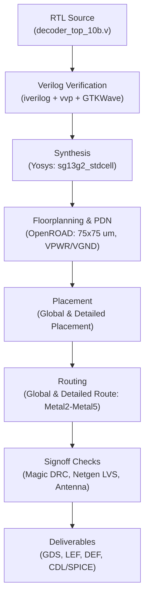

# 10-Bit Top-Level Digital Decoder (`decoder_top_10b`) LibreLane Implementation Note
**Project:** Programmable Instrumentation Amplifier IP (Chipalooza)  
**Process Technology:** IHP SG13G2 / SG13CMOS5L ($0.13\,\mu\text{m}$ BiCMOS)  
**Standard Cell Library:** `sg13g2_stdcell` ($1.2\,\text{V}$)  
**Target Toolchain:** LibreLane / OpenROAD Flow  
**Target Directory:** [`designs/libs/core_digital/decoder_top_10b/librelane/`](file:///home/ranantalden/Projects/Designs/Chipalooza/Programmable-Instrumentation-Amplifier-IP/designs/libs/core_digital/decoder_top_10b/librelane/)

---

## 1. Executive Summary & Subsystem Architecture

The **`decoder_top_10b`** serves as the unified digital control engine for the Programmable Gain Instrumentation Amplifier (PGIA). It receives a 10-bit binary digital gain code $D[9:0]$ ($1024$ distinct states) and generates the full set of digital switching signals required by the mixed-signal analog core:

1. **Coarse Gain Decoder ($D[3:0] \rightarrow Y[15:0]$):**
   - Decodes the lower 4 bits into 16 active-high one-hot tap select lines.
   - Drives transmission gates selecting the coarse feedback resistor tap, establishing nominal gain steps of $6.00\,\text{dB}$ across a dynamic range from $18.06\,\text{dB}$ up to $78.00\,\text{dB}$.
2. **Fine Gain Steering Driver ($D[9:4] \rightarrow S[9:4],\, SB[9:4]$):**
   - Buffers the upper 6 bits into complementary differential pairs ($S_i$ and $S_{Bi} = \overline{S_i}$).
   - Steers binary-weighted current/resistor elements in the fine interpolation network, giving a fine step resolution of $+0.0586\,\text{dB}$.

```
                               ┌────────────────────────────────────────────────────────┐
                               │                    decoder_top_10b                     │
                               │                                                        │
          D[3:0] (Coarse) ────►│  ┌──────────────────────┐                              │
            (4 bits)           │  │   4-to-16 Decoder    ├─────► Y[15:0] (16 One-Hot)   │
                               │  └──────────────────────┘                              │
                               │                                                        │
          D[9:4] (Fine)   ────►│  ┌──────────────────────┐     ┌─► S[9:4]  (6 True)     │
            (6 bits)           │  │ Complementary Driver ├─────┤                        │
                               │  └──────────────────────┘     └─► SB[9:4] (6 Inverted) │
                               │                                                        │
           VDD / VSS      ────►│  Power Grid (1.2V Core)                                │
                               └────────────────────────────────────────────────────────┘
```

---

## 2. Port Interface & Logic Mapping

### 2.1 Pin Definitions

| Signal Name | Width | Direction | Domain | Description |
| :--- | :---: | :---: | :---: | :--- |
| `d[9:0]` | 10 | Input | $1.2\,\text{V}$ Logic | Top-level digital gain programming word. |
| `y[15:0]` | 16 | Output | $1.2\,\text{V}$ Logic | Active-high one-hot coarse tap selections ($Y_k = 1 \iff D[3:0] == k$). |
| `s[9:4]` | 6 | Output | $1.2\,\text{V}$ Logic | True buffered steering controls ($S_i = D_i$). |
| `sb[9:4]` | 6 | Output | $1.2\,\text{V}$ Logic | Complementary inverted steering controls ($SB_i = \overline{D_i}$). |
| `VDD` / `VPWR` | 1 | Inout | $1.2\,\text{V}$ | Core digital supply voltage. |
| `VSS` / `VGND` | 1 | Inout | $0.0\,\text{V}$ | Core digital ground. |

### 2.2 Mathematical Transfer Functions

$$\begin{aligned}
Y_k &= \begin{cases} 1, & \text{if } D[3:0] = k \\ 0, & \text{if } D[3:0] \neq k \end{cases} \quad \text{for } k \in [0, 15] \\
S_i &= D_i \quad \text{for } i \in [4, 9] \\
SB_i &= \overline{D_i} \quad \text{for } i \in [4, 9]
\end{aligned}$$

---

## 3. RTL Implementation (`decoder_top_10b.v`)

The Verilog implementation resides in [`decoder_top_10b.v`](file:///home/ranantalden/Projects/Designs/Chipalooza/Programmable-Instrumentation-Amplifier-IP/designs/libs/core_digital/decoder_top_10b/librelane/decoder_top_10b.v):

```verilog
// =============================================================================
// Module: decoder_top_10b
// Project: Programmable Instrumentation Amplifier IP (Chipalooza)
// Technology: IHP SG13G2 / SG13CMOS5L (130nm BiCMOS)
// Description:
//   Top-level 10-bit digital decoder subsystem combining:
//     1. Coarse Decoder: 4-to-16 active-high one-hot decoder (D[3:0] -> Y[15:0])
//     2. Fine Steering Drivers: 6-bit complementary drivers (D[9:4] -> S[9:4], SB[9:4])
// =============================================================================

`timescale 1ns / 1ps

module decoder_top_10b (
    input  wire [9:0]  d,
    output wire [15:0] y,
    output wire [9:4]  s,
    output wire [9:4]  sb
);

    // Coarse Gain Decoder Logic (4-to-16 Active-High One-Hot)
    assign y = 16'h0001 << d[3:0];

    // Fine Gain Steering Logic (True & Complementary Buffer Pairs)
    assign s  =  d[9:4];
    assign sb = ~d[9:4];

endmodule
```

---

## 4. Verification Testbench (`tb_decoder_top_10b.v`)

The self-checking testbench verifies functional correctness, edge corner behaviors, and generates a `.vcd` file for GTKWave visualization:

- **Test Suite 1 (Exhaustive Coarse):** Cycles through all 16 values of $D[3:0]$, verifying that exactly one tap $Y_k$ is high and 15 taps are low.
- **Test Suite 2 (Steering Complementarity):** Sweeps fine bits $D[9:4]$ across boundary patterns, alternating bit arrays, and walking codes, confirming $(S_i \oplus SB_i) \equiv 1$.
- **Test Suite 3 (Dynamic Range Extremes):**
  - Minimum Gain Code (`0x000` $\rightarrow 18.06\,\text{dB}$): $Y_0=1$, $S=0$, $SB=1$.
  - Maximum Gain Code (`0x3FF` $\rightarrow 78.00\,\text{dB}$): $Y_{15}=1$, $S=1$, $SB=0$.

### Simulation Execution:
```bash
# Compile and run testbench inside container:
iverilog -o sim_decoder_top_10b tb_decoder_top_10b.v decoder_top_10b.v
vvp sim_decoder_top_10b

# Inspect waveforms:
gtkwave tb_decoder_top_10b.vcd &
```

---

## 5. LibreLane Configuration (`config.json`)

The LibreLane flow is configured in [`config.json`](file:///home/ranantalden/Projects/Designs/Chipalooza/Programmable-Instrumentation-Amplifier-IP/designs/libs/core_digital/decoder_top_10b/librelane/config.json):

```json
{
  "DESIGN_NAME": "decoder_top_10b",
  "VERILOG_FILES": ["dir::decoder_top_10b.v"],
  "CLOCK_PORT": null,
  "PDN_MULTILAYER": false,
  "FP_SIZING": "absolute",
  "DIE_AREA": [0, 0, 75, 75],
  "PL_TARGET_DENSITY_PCT": 40,
  "SYNTH_ARITH_TREE": false
}
```

### Key Configuration Rationale:
1. `"CLOCK_PORT": null`: Pure combinational design; prevents OpenROAD STA/CTS engine from failing looking for a clock tree.
2. `"SYNTH_ARITH_TREE": false`: Avoids invoking the unsupported `arith_tree` pass in Yosys.
3. `"PDN_MULTILAYER": false`: Eliminates deprecated multilayer power distribution warnings.
4. `"DIE_AREA": [0, 0, 75, 75]`:
   - Core dimensions: $75\,\mu\text{m} \times 75\,\mu\text{m}$ ($300\,\mu\text{m}$ perimeter).
   - Readily accommodates all 38 signal pins + power pins with $>7.5\,\mu\text{m}$ pin pitch.
   - Ample routing space ensures 0 DRC, 0 LVS, and 0 antenna violations.
5. `"PL_TARGET_DENSITY_PCT": 40`: Leaves room for decap insertion, welltaps, and buffer insertion.

---

## 6. End-to-End RTL-to-GDS Execution Flow



### Execution Command:
```bash
docker exec -i iic-osic-tools_x11 bash -lc "cd /foss/designs/Chipalooza/Programmable-Instrumentation-Amplifier-IP/designs/libs/core_digital/decoder_top_10b/librelane && librelane config.json < /dev/null"
```

---

## 7. Signoff Criteria & Execution Results

The 80-stage LibreLane flow completed with 100% clean signoff metrics:

| Checkpoint | Target Tool | Acceptance Criteria | Measured Result | Status |
| :--- | :--- | :--- | :--- | :---: |
| **Logic Verification** | `iverilog` / `vvp` | 0 errors across exhaustive sweeps | 0 errors, full VCD generated | **PASSED ✅** |
| **Synthesis** | Yosys | Clean netlist, no unmapped cells | 0 unmapped instances | **PASSED ✅** |
| **Floorplan Sizing** | OpenROAD | $75\,\mu\text{m} \times 75\,\mu\text{m}$ die area | Bounding box: `[0.0, 0.0, 75.0, 75.0]` | **PASSED ✅** |
| **Detailed Route DRC** | OpenROAD TritonRoute | 0 DRC violations | 0 errors (`route__drc_errors: 0`) | **PASSED ✅** |
| **Physical Signoff DRC** | Magic & KLayout | 0 DRC violations | 0 errors (`magic__drc: 0`, `klayout__drc: 0`) | **PASSED ✅** |
| **Layout vs Schematic** | Netgen LVS | Unique match against synthesized netlist | Circuits match uniquely (78 devs, 86 nets) | **PASSED ✅** |
| **Antenna Verification** | Magic / OpenROAD | 0 antenna ratio violations | 0 antenna violating nets | **PASSED ✅** |
| **Timing & Slew** | OpenROAD STA | No setup, hold, or max slew violations | 0 setup / 0 hold / 0 slew violations | **PASSED ✅** |
| **Elapsed Flow Time** | LibreLane Flow | Fast compilation | **1m 34s** (80 of 80 stages) | **PASSED ✅** |

---

## 8. Physical Deliverables & Top-Level AMS Integration

All signoff views have been generated and archived in [`runs/RUN_2026-09-28_08-56-18/final/`](file:///home/ranantalden/Projects/Designs/Chipalooza/Programmable-Instrumentation-Amplifier-IP/designs/libs/core_digital/decoder_top_10b/librelane/runs/RUN_2026-09-28_08-56-18/final/):

- **GDSII Layout:** `final/gds/decoder_top_10b.gds` (and `final/klayout_gds/decoder_top_10b.gds`)
- **LEF Macro Abstract:** `final/lef/decoder_top_10b.lef`
- **DEF Placement & Routing:** `final/def/decoder_top_10b.def`
- **Extracted SPICE Netlist:** `final/spice/decoder_top_10b.spice`

### Extracted Subcircuit Port Mapping for AMS Co-Simulation:
```spice
.subckt decoder_top_10b VGND VPWR d[0] d[1] d[2] d[3] d[4] d[5] d[6] d[7] d[8] d[9]
+ s[4] s[5] s[6] s[7] s[8] s[9] sb[4] sb[5] sb[6] sb[7] sb[8] sb[9] y[0] y[10] y[11]
+ y[12] y[13] y[14] y[15] y[1] y[2] y[3] y[4] y[5] y[6] y[7] y[8] y[9]
```
- **Power:** Connect `VPWR` to $1.2\,\text{V}$ `VDD` and `VGND` to `VSS`.
- **Inputs:** `d[3:0]` maps to coarse gain code; `d[9:4]` maps to fine gain code.
- **Outputs:** `y[15:0]` drives the 16 feedback resistor taps; `s[9:4]` and `sb[9:4]` drive the differential transmission gate steering network.

