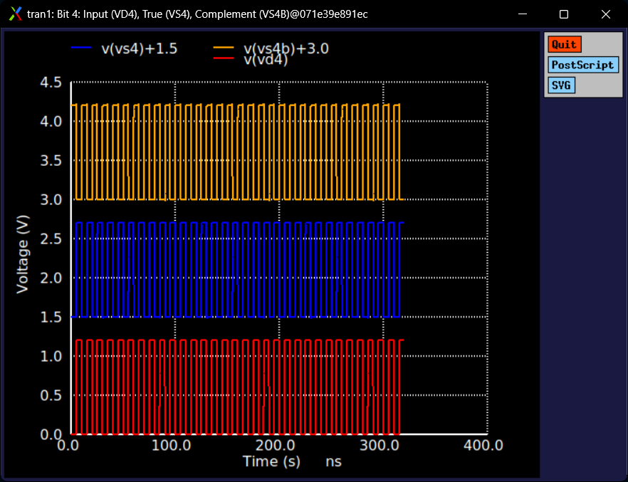
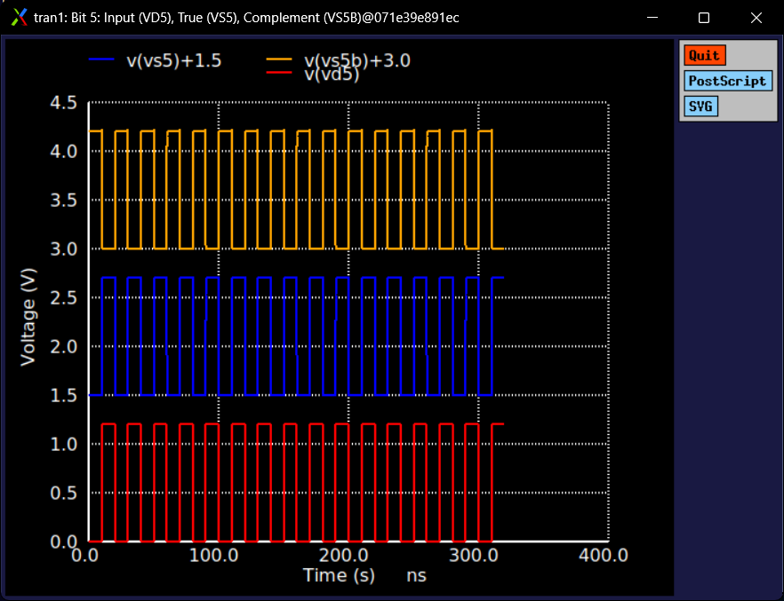
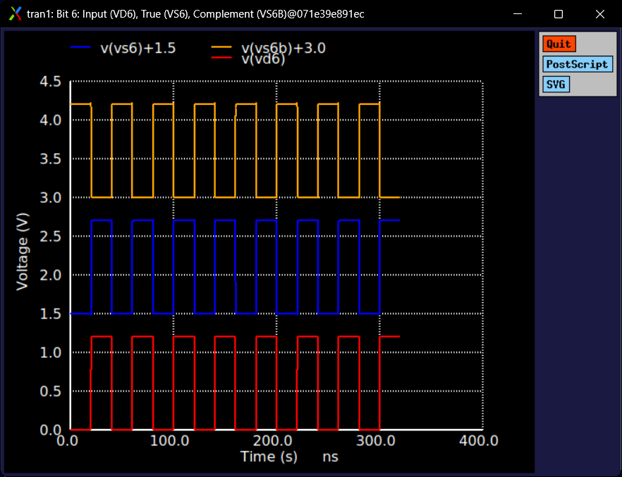
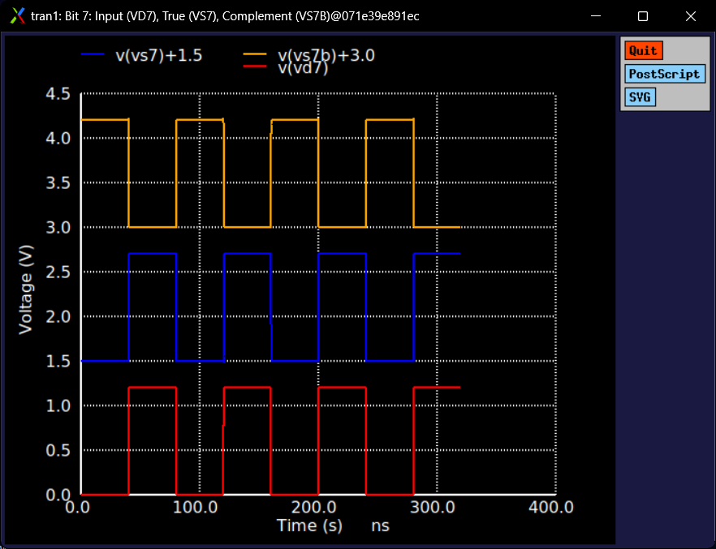
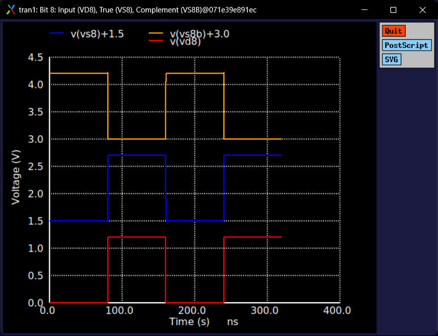

# 6-Bit Fine Driver Array (`fine_driver_6b`) Technical Note

## 1. Overview & Context

- **Block:** 6-Bit Complementary Switch Driver Array (`fine_driver_6b`)
- **Location:** `designs/libs/core_digital/fine_driver_6b/`
- **Role in IP:** Digital interface and steering driver for the **Fine-Gain Stage (Stage 3)**:
  - Takes the upper 6 bits (`D4 - D9`) of the 10-bit gain control word.
  - Generates 6 pairs of synchronized true and complementary gate control signals ($S_4/S_{4B}$ to $S_9/S_{9B}$) to drive the transmission gates in the 6-bit R-2R ladder network.
  - Tunes fine gain from $0\text{ dB}$ to $+3.69\text{ dB}$ with a resolution of $+0.0586\text{ dB}$ per LSB.
- **Operating Domain:** $1.2\text{ V}$ Core/Digital domain (`DVDD` / `DVSS`).

---

## 2. Circuit Architecture & Topology

Each digital bit $D_i$ ($i \in \{4, 5, 6, 7, 8, 9\}$) drives a parallel buffer and inverter channel to provide matched, low-skew complementary outputs:

```
  D_i (Input) ────┬────► [ sg13cmos5l_buf_1 ] ────► S_i     (True: Connects 2R leg to Virtual Ground)
                  │
                  └────► [ sg13cmos5l_inv_1 ] ────► S_i_B   (Complement: Shunts 2R leg to Common-Mode / GND)
```

### Standard Cell Count
* **$6\times$ `sg13cmos5l_buf_1`:** Non-inverting buffers driving true switch control lines $S_4, S_5, S_6, S_7, S_8, S_9$.
* **$6\times$ `sg13cmos5l_inv_1`:** Inverters driving complementary switch control lines $S_{4B}, S_{5B}, S_{6B}, S_{7B}, S_{8B}, S_{9B}$.
* Total Cells: 12 standard logic gates arranged in 6 parallel rows.

### Subcircuit Interface
```spice
.subckt fine_driver_6b D4 D7 S4 S4B VDD VSS D5 D6 D8 D9 S5 S5B S6 S6B S7 S7B S8 S8B S9 S9B
```
* **Inputs:** `D4, D5, D6, D7, D8, D9` (6-bit fine gain digital bus).
* **Outputs:** `S4, S4B, S5, S5B, S6, S6B, S7, S7B, S8, S8B, S9, S9B` (12 complementary switch lines).
* **Power Rails:** `VDD` ($1.2\text{ V}$), `VSS` ($0\text{ V}$).

---

## 3. Truth Table & R-2R Steering Operation

| Input State (Di) | True Output (Si) | Complement Output (SiB) | Active Switch | R-2R Leg Steering Action |
| :---: | :---: | :---: | :---: | :--- |
| 0 (0 V) | 0 (0 V) | **1 (1.2 V)** | Switch B (Shunt) | Shunts current leg to Common-Mode / Ground (0 contribution) |
| 1 (1.2 V) | **1 (1.2 V)** | 0 (0 V) | Switch A (Signal) | Steers binary-weighted current to Op-Amp Virtual Ground |

---

## 4. Testbench & Simulation Setup

* **Testbench Schematic:** `tb_fine_driver_6b.sch` (`tb_fine_driver_6b.spice`)
* **Supply Rails:** `VDD = 1.2 V`, `VSS = 0 V`
* **Input Stimulus:** 6 binary frequency division square wave pulse generators:
  * `V4` ($D_4$, LSB): `PULSE(0 1.2 5n 100p 100p 5n 10n)` ($T = 10\text{ ns}$)
  * `V5` ($D_5$): `PULSE(0 1.2 10n 100p 100p 10n 20n)` ($T = 20\text{ ns}$)
  * `V6` ($D_6$): `PULSE(0 1.2 20n 100p 100p 20n 40n)` ($T = 40\text{ ns}$)
  * `V7` ($D_7$): `PULSE(0 1.2 40n 100p 100p 40n 80n)` ($T = 80\text{ ns}$)
  * `V8` ($D_8$): `PULSE(0 1.2 80n 100p 100p 80n 160n)` ($T = 160\text{ ns}$)
  * `V9` ($D_9$, MSB): `PULSE(0 1.2 160n 100p 100p 160n 320n)` ($T = 320\text{ ns}$)
* **Output Loading:** $C_L = 10\text{ fF}$ on each of the 12 output nodes.
* **Transient Analysis:** `.tran 100p 320n`.

---

## 5. Simulation Results & Waveforms

### Channel Waveforms ($D_4 - D_9$)

#### Bit 4 (LSB) & Bit 5



#### Bit 6 & Bit 7



#### Bit 8 & Bit 9 (MSB)



### Key Performance Metrics
| Parameter | Measured Value | Specification / Notes |
| :--- | :--- | :--- |
| **Logic High (VOH)** | **1.200 V** | Full rail swing on all 12 outputs |
| **Logic Low (VOL)** | **< 1 nV** | Near-zero static offset |
| **Propagation Delay (tpd)** | **< 150 ps** | Buffer and inverter switching into 10 fF load |
| **Complementary Skew (Buffer vs Inverter)** | **< 45 ps** | Clean cross-over near mid-rail (0.6 V) |
| **Complementary Exclusivity** | **100% Verified** | Si and SiB are strictly out-of-phase |

---

## 6. Integration & System Takeaways

1. **Top-Level Digital Assembly (`decoder_top_10b`):**
   * Combined with `dec4to16` (coarse 4-bit decoder), `fine_driver_6b` completes the digital control core.
   * `D[3:0]` controls coarse 16-tap gain ($0\text{ dB}$ to $+56.25\text{ dB}$ in $+3.75\text{ dB}$ steps).
   * `D[9:4]` controls fine 64-level R-2R gain ($0\text{ dB}$ to $+3.69\text{ dB}$ in $+0.0586\text{ dB}$ steps).
2. **Analog Switch Drive:**
   * $S_i$ directly drives the NMOS gate of Switch A; $S_{i,B}$ drives the NMOS gate of Switch B.
   * Cross-coupled inverter connections at the switches provide matched PMOS complementary gate controls.

---

## 7. Current File Locations

* **Schematic:** `designs/libs/core_digital/fine_driver_6b/fine_driver_6b.sch`
* **Symbol:** `designs/libs/core_digital/fine_driver_6b/fine_driver_6b.sym`
* **Testbench:** `designs/libs/core_digital/fine_driver_6b/tb_fine_driver_6b.sch`
* **Simulation Netlist & Raw:** `designs/libs/core_digital/fine_driver_6b/simulations/tb_fine_driver_6b.spice` / `tb_fine_driver_6b.raw`
* **Simulation Log:** `docs/digital_decoder/fine_driver_6b/ngspice_log.txt`
