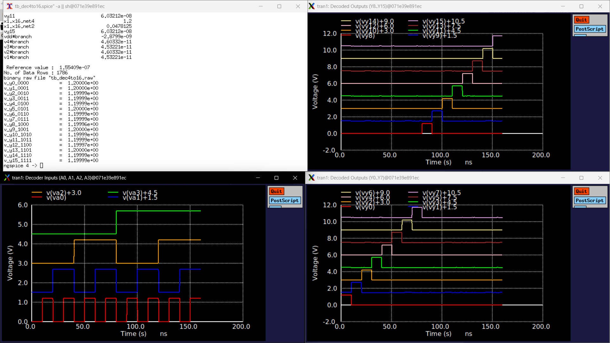

# 4-to-16 Binary Decoder (`dec4to16`) Technical Note

## 1. Overview & Context

- **Block:** 4-to-16 Active-High Binary Decoder (`dec4to16`)
- **Location:** `designs/libs/core_digital/dec4to16/`
- **Role in IP:** Serves as the primary one-hot tap selector for the **Coarse-Gain Stage (Stage 2)**:
  - Translates the 4-bit coarse gain control word (`D0 - D3`) into 16 mutually exclusive select lines ($Y_0 - Y_{15}$).
  - Drives 16 CMOS transmission gates (`tgate`) along a 17-resistor feedback ladder, setting stage gain from $0\text{ dB}$ to $+56.25\text{ dB}$ in $+3.75\text{ dB}$ steps.
- **Operating Domain:** $1.2\text{ V}$ Core/Digital domain (`DVDD` / `DVSS`).

---

## 2. Circuit Architecture & Logic Mapping

To minimize input capacitance on the digital bus, avoid slow 4-input gate stacks, and keep layout modular, a **2-level pre-decoding topology** is employed:

```
                     ┌──────────────────┐
  A0 (LSB) ─────────►│     dec2to4      ├──► P0..P3 (Lower Pre-decode)
  A1       ─────────►│  (x_dec_low)     │
                     └──────────────────┘
                                              4×4 AND2 Array (16 gates)
                     ┌──────────────────┐    ┌────────────────────────────┐
  A2       ─────────►│     dec2to4      ├───►│ Y[k] = Q[j] · P[i]         ├──► Y0..Y15
  A3 (MSB) ─────────►│  (x_dec_high)    ├───►│ (16× sg13cmos5l_and2_1)    │
                     └──────────────────┘    └────────────────────────────┘
                                               where k = 4j + i
```

### Component Breakdown
* **Pre-decoders ($2\times$ `dec2to4`):**
  * `x_dec_low`: Decodes address bits $A_0, A_1$ into lower minterms $P_0, P_1, P_2, P_3$.
  * `x_dec_high`: Decodes address bits $A_2, A_3$ into upper minterms $Q_0, Q_1, Q_2, Q_3$.
* **Output Matrix ($16\times$ `sg13cmos5l_and2_1`):**
  * 16 two-input standard cell AND gates combining pairs $(Q_j, P_i)$ to generate one-hot outputs $Y_0 - Y_{15}$.

### Subcircuit Interface
```spice
.subckt dec4to16 A0 A3 Y0 Y1 Y2 Y3 VDD VSS Y4 Y5 Y6 Y7 Y8 Y9 Y10 Y11 Y12 Y13 Y14 Y15 A1 A2
```
* **Inputs:** `A0, A1, A2, A3` (4-bit binary address bus).
* **Outputs:** `Y0` through `Y15` (16 one-hot active-high switch control lines).
* **Power Rails:** `VDD` ($1.2\text{ V}$), `VSS` ($0\text{ V}$).

---

## 3. Truth Table & Coarse Gain Mapping

| State | A3 (MSB) | A2 | A1 | A0 (LSB) | Active Output | Selected Switch | Coarse Gain Step |
| :---: | :---: | :---: | :---: | :---: | :---: | :---: | :---: |
| **0000** | 0 (0 V) | 0 (0 V) | 0 (0 V) | 0 (0 V) | **Y0 (1.2 V)** | SW0 | **0.00 dB** |
| **0001** | 0 (0 V) | 0 (0 V) | 0 (0 V) | 1 (1.2 V) | **Y1 (1.2 V)** | SW1 | **+3.75 dB** |
| **0010** | 0 (0 V) | 0 (0 V) | 1 (1.2 V) | 0 (0 V) | **Y2 (1.2 V)** | SW2 | **+7.50 dB** |
| **0011** | 0 (0 V) | 0 (0 V) | 1 (1.2 V) | 1 (1.2 V) | **Y3 (1.2 V)** | SW3 | **+11.25 dB** |
| **0100** | 0 (0 V) | 1 (1.2 V) | 0 (0 V) | 0 (0 V) | **Y4 (1.2 V)** | SW4 | **+15.00 dB** |
| **0101** | 0 (0 V) | 1 (1.2 V) | 0 (0 V) | 1 (1.2 V) | **Y5 (1.2 V)** | SW5 | **+18.75 dB** |
| **0110** | 0 (0 V) | 1 (1.2 V) | 1 (1.2 V) | 0 (0 V) | **Y6 (1.2 V)** | SW6 | **+22.50 dB** |
| **0111** | 0 (0 V) | 1 (1.2 V) | 1 (1.2 V) | 1 (1.2 V) | **Y7 (1.2 V)** | SW7 | **+26.25 dB** |
| **1000** | 1 (1.2 V) | 0 (0 V) | 0 (0 V) | 0 (0 V) | **Y8 (1.2 V)** | SW8 | **+30.00 dB** |
| **1001** | 1 (1.2 V) | 0 (0 V) | 0 (0 V) | 1 (1.2 V) | **Y9 (1.2 V)** | SW9 | **+33.75 dB** |
| **1010** | 1 (1.2 V) | 0 (0 V) | 1 (1.2 V) | 0 (0 V) | **Y10 (1.2 V)** | SW10 | **+37.50 dB** |
| **1011** | 1 (1.2 V) | 0 (0 V) | 1 (1.2 V) | 1 (1.2 V) | **Y11 (1.2 V)** | SW11 | **+41.25 dB** |
| **1100** | 1 (1.2 V) | 1 (1.2 V) | 0 (0 V) | 0 (0 V) | **Y12 (1.2 V)** | SW12 | **+45.00 dB** |
| **1101** | 1 (1.2 V) | 1 (1.2 V) | 0 (0 V) | 1 (1.2 V) | **Y13 (1.2 V)** | SW13 | **+48.75 dB** |
| **1110** | 1 (1.2 V) | 1 (1.2 V) | 1 (1.2 V) | 0 (0 V) | **Y14 (1.2 V)** | SW14 | **+52.50 dB** |
| **1111** | 1 (1.2 V) | 1 (1.2 V) | 1 (1.2 V) | 1 (1.2 V) | **Y15 (1.2 V)** | SW15 | **+56.25 dB** |

---

## 4. Testbench & Simulation Setup

* **Testbench Schematic:** `tb_dec4to16.sch` (`tb_dec4to16.spice`)
* **Supply Rails:** `VDD = 1.2 V`, `VSS = 0 V`
* **Input Stimulus (Binary Counter):**
  * `V1` ($A_0$, LSB): `PULSE(0 1.2 10n 100p 100p 10n 20n)` ($T = 20\text{ ns}$)
  * `V2` ($A_1$): `PULSE(0 1.2 20n 100p 100p 20n 40n)` ($T = 40\text{ ns}$)
  * `V3` ($A_2$): `PULSE(0 1.2 40n 100p 100p 40n 80n)` ($T = 80\text{ ns}$)
  * `V4` ($A_3$, MSB): `PULSE(0 1.2 80n 100p 100p 80n 160n)` ($T = 160\text{ ns}$)
* **Output Loading:** $C_{L0} - C_{L15} = 10\text{ fF}$ per channel.
* **Transient Analysis:** `.tran 100p 160n` covering all 16 states ($10\text{ ns}$ per step).

---

## 5. Simulation Results & Waveforms



### Key Performance Metrics
| Parameter | Measured Value | Requirement / Notes |
| :--- | :--- | :--- |
| **Logic High ($V_{OH}$)** | **$1.200\text{ V}$** | Full CMOS rail |
| **Logic Low ($V_{OL}$)** | **$< 10\text{ }\mu\text{V}$** | Zero static offset |
| **Propagation Delay ($t_{pd}$)** | **$< 220\text{ ps}$** | Fast switching into $10\text{ fF}$ load |
| **Truth Table Compliance** | **$16 / 16$ States Verified** | All `.meas` checks read $1.200\text{ V}$ |
| **Peak Transient Glitch** | **$< 0.18\text{ V}$** | Well below logic threshold ($V_{TH} \approx 0.6\text{ V}$) |

---

## 6. Important Engineering & Integration Takeaways

1. **Hierarchy Reusability:**
   * Leveraging `dec2to4` as a hardened sub-block significantly reduced schematic clutter and eliminates 4-input gate parasitics.
2. **Top-Level Integration:**
   * `dec4to16` is now ready for instantiation in [`decoder_top_10b.sch`](file:///home/ranantalden/Projects/Designs/Chipalooza/Programmable-Instrumentation-Amplifier-IP/designs/libs/core_digital/decoder_top_10b/decoder_top_10b.sch) where it connects to the lower 4 bits `D[3:0]`.
3. **Switch Driver Compatibility:**
   * The active-high outputs $Y_0 - Y_{15}$ directly drive NMOS transmission gates (`EN`); complementary PMOS gate drives (`ENB`) can be generated via local inverters at the switch array to minimize digital routing congestion.

---

## 7. Current File Locations

* **Schematic:** `designs/libs/core_digital/dec4to16/dec4to16.sch`
* **Symbol:** `designs/libs/core_digital/dec4to16/dec4to16.sym`
* **Testbench:** `designs/libs/core_digital/dec4to16/tb_dec4to16.sch`
* **Simulation Netlist & Raw:** `designs/libs/core_digital/dec4to16/simulations/tb_dec4to16.spice` / `tb_dec4to16.raw`
